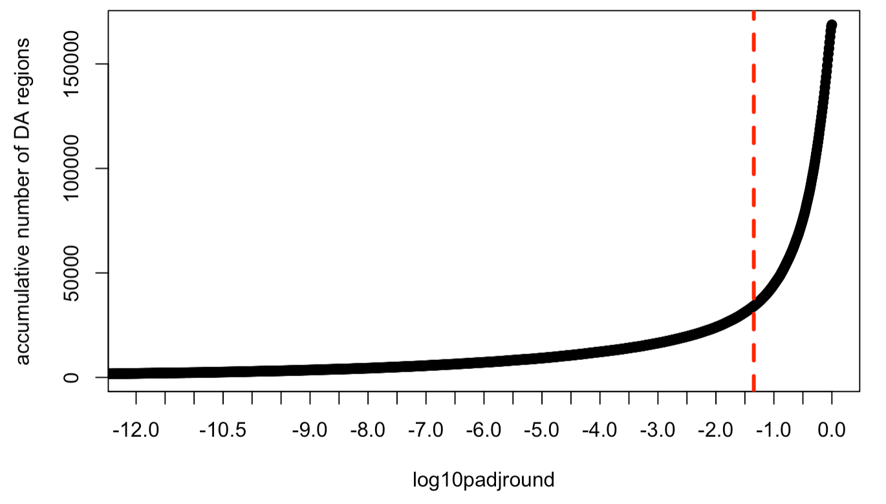
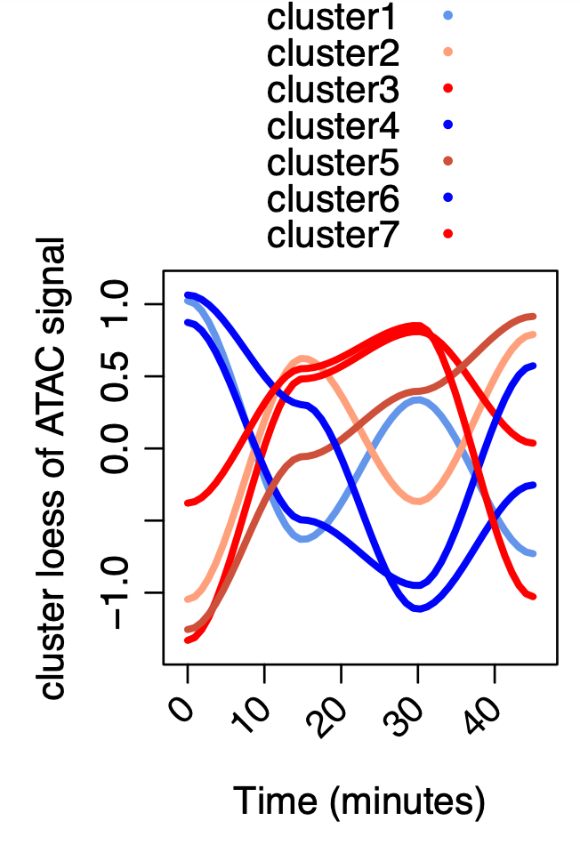
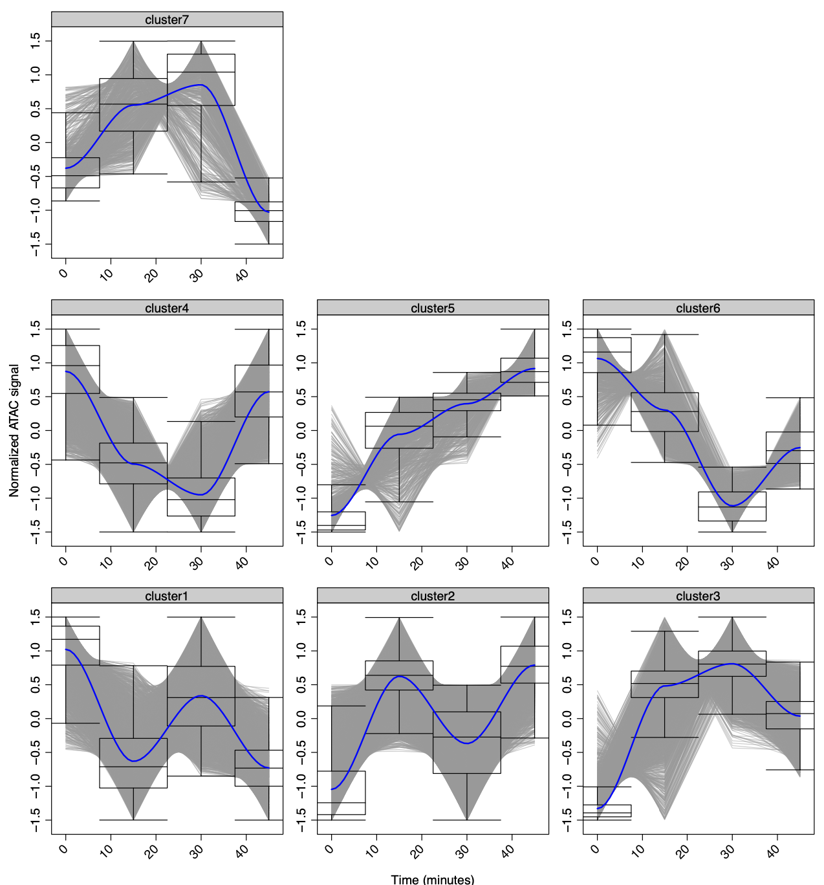
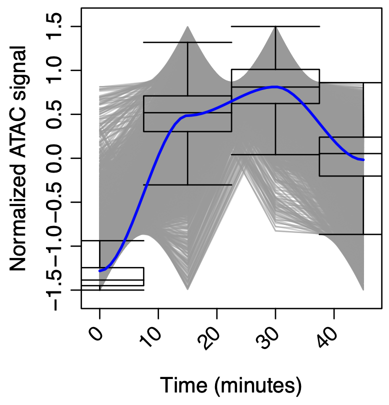
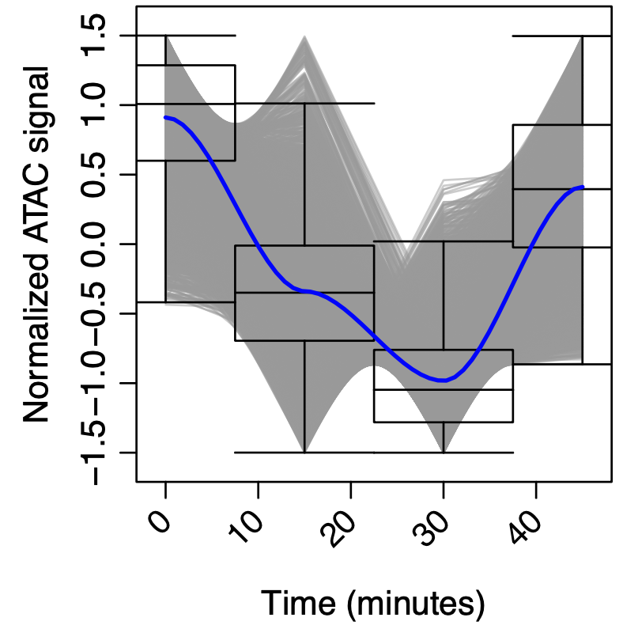
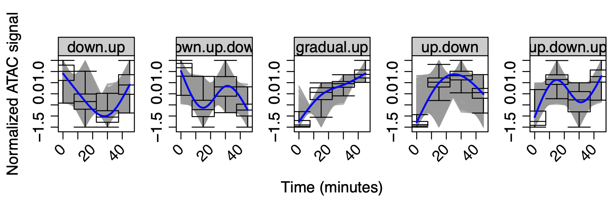

\sffamily


# Logging into the Xanadu cluster 

To access the cluster you need to login with **ssh** (secure shell):

```{r engine='bash', eval=F, echo=TRUE}
ssh <user_name>@xanadu-submit-ext.cam.uchc.edu 

# you user name looks like this:
ssh ssun@xanadu-submit-ext.cam.uchc.edu 
```

# Tranferring data to and from the cluster

To move files in between computer you can login with **sftp** use **scp** (secure copy):

## **`sftp`**: 

`ftp` stands for "File Transfer Protocol", `sftp` is " Secure File Transfer Protocol".  In other words, with sftp, a useraccount and password are required.\
```{r engine='bash', eval=F, echo=TRUE}

sftp  <your_username>@<host_name>
```
For the Xanadu cluster, there is a special partition for transferring data:

```{r engine='bash', eval=F, echo=TRUE}

sftp ssun@transfer.cam.uchc.edu
```

**1.** You can then navigate to the directory where you want to take files from.\
**2.** **put** and **get** can be used to move files from or to your computer, respectively \

## **`scp`**
**scp** can be used without logging in provided you know the exact location where your file of interest is or will go. We will primarily use `sftp` in this course.

```{r engine='bash', eval=F, echo=TRUE}
# for copying TO the server
scp -r <path_to_directory> <your_username>@transfer.cam.uchc.edu:~/path/to/target/folder
```

You should be prompted for a password.  If not, the transfer probably failed.
```{r engine='bash', eval=F, echo=TRUE}
# for copying FROM the server
scp -r <your_username>@<host_name>:<target_directory> 
```

### How do we know if transfer was complete?

There's a program called `md5` (mac) or `md5sum` (linux) that can help us with this.  It returns a compact digital fingerprint for each file.  Any change to the file will result in a different fingerprint.

on a mac:
```{r engine='bash', eval=F, echo=TRUE}
md5 Macrophage_15min_rep1_PE1.fastq.gz
```

on Linux:
```{r engine='bash', eval=F, echo=TRUE}
md5sum Macrophage_15min_rep1_PE1.fastq.gz
```

## Exercise 1: Inspecting, retrieving, and checking files from server

**1** Log onto the server using ssh \
**2** Navigate to your folder in `/labs/Guertin/siyu` \
**3** View the checksum string for the file `Macrophage_15min_rep1_PE1.fastq.gz`. \
**4** Logout and return to your home directory or open a new terminal window (command-t) \
**5** Transfer the file to your computer using sftp \
**6** Confirm that the transfer was complete \

# Running interactive sessions and batch scripts on Xanadu

Xanadu uses the SLURM (Simple Linux Utility for Resource Management) language to manage workloads.\
Documentation:\
[https://slurm.schedmd.com/](https://slurm.schedmd.com/)

## Interactive session

### Important: All actions that require CPU or memory should be run from an interactive session to avoid jamming the head node.

The head node is like a lobby where everyone enters a space, but actions should not be taken here.  You should request a 'room' or interactive session in which to conduct your business.\

To see if you are on the head node you can use the `hostname` command. If the `hostname` ends in `.cam.uchc.edu`, then you are on the head node. If the `hostname` is `xanadu-*`, then you are in an interactive session. If you are not working in an interactive session, then `exit` so that resources are available to other users.


```{r engine='bash', eval=F, echo=TRUE}

hostname
#simplest way to start a session
srun --pty -p general --qos=general  bash
hostname
exit
hostname

#request 4 cores and 16 Gb of RAM (this is what I typically request)
srun --pty --qos=general -p general -c 4 --mem=16G bash

hostname
exit
```

To confirm that you are indeed in an interactive session, try the 'hostname' command and it should return `xanadu-<n>`


## Batch scripts
Sbatch (Slurm Batch) scripts need to start with a header that contains important information for running and reporting the output of your script. `sbatch-template.sh`
```{r engine='bash', eval=F, echo=TRUE}
#!/bin/bash

#SBATCH --job-name=hello.sh     # name for job
#SBATCH -N 1                    # number of nodes 
#SBATCH -n 1                    # number of jobs / tasks 
#SBATCH -c 1                    # number of cores 
#SBATCH -p general           # SLURM partition 
#SBATCH --qos=general        # SLURM Quality of service 
#SBATCH --mem=1G                # RAM (memory) requested 
#SBATCH --mail-type=ALL 
#SBATCH --mail-user=ssun@uchc.edu
#SBATCH -o scriptname.sh_%j.out
#SBATCH -e scriptname.sh_%j.err

hostname # have this at beginning of every script for  troubleshooting

<your script>
```

here is a random script:
```{r engine='bash', eval=F, echo=TRUE}
#! /bin/sh
list="1 0 3 6"

for x in $list
  do
# sleep for a few minutes so it is not immediately completed!  
  	sleep 30s
    echo Welcome to Batch submissions
    echo $x
  done

echo $list
```

Here is one way to save it as a file:

```{r engine='bash', eval=F, echo=TRUE}
touch welcome_batch.sh
nano welcome_batch.sh

# copy and paste the batch header and script into the nano text editor 
# Ctrl + O (save--also use the text prompt to rename if needed)
# Enter
# Ctrl + X (exit)
```

We can add this script to our batch script and rename it `welcome_batch.sh`. \
To run the script we use:

```{r engine='bash', eval=F, echo=TRUE}
sbatch welcome_batch.sh
```

To check the status there are several options:

```{r engine='bash', eval=F, echo=TRUE}
squeue #check the status of the entire queue

squeue -u <usrID> # check the status of all jobs by a user

squeue -j <jobID>  # Check status of specific job

```

If something is wrong and you want to kill a job:
```{r engine='bash', eval=F, echo=TRUE}
scancel <jobID>
```

You can also check the status of the server to see how busy it is with **`sinfo`**
```{r engine='bash', eval=F, echo=TRUE}
sinfo --format="%10P  %6t %15O %15C %15F %10m %10e %15n %30E %10u" 
```

## In class exercise 1:  running and altering batch scripts

**1.** Copy the `sbatch-template.sh` script from above into your home directory. \
**2** Add the `welcome_batch.sh` script to your batch script, and adjust the other user input (email, jobID, etc) appropriately. \
**3.** Save and run the script. Where did the output go?                
**4.** create a `sbatch-output` folder in your home directory and alter the sbatch script such that the output and errors go to this folder. \
**5.** intentionally create an error in your script (e.g. add double quotes but don't close them), and run the script again. Now check the error file to see an example of error outputs. \
**6.** Use the sbatch script to run another script from your scripts folder by calling it directly.  i.e. instead of having the `welcome-batch` script commands in the sbatch file, create another script and run that with the batch script. \

# Server operations: Using `module` to temporarily load functions:

We're going to use the `cutadapt` and `bowtie2` amongst other software.  These programs are on the server, however, we need to load them into our session for use. On our own machine we made sure the programs were in our **`$PATH`**.  On the server we can use the **`module`** to load and have access to specific functions during your session without altering your **`$PATH`**.  This provides flexibility and specificity in running software versions.
\
First, view which modules are available:
```{r engine='bash', eval=F, echo=TRUE}
module avail  
```

We can check specifically for sratoolkit:

```{r engine='bash', eval=F, echo=TRUE}
module avail cutadapt
```
Once you find the one you're looking for:

```{r engine='bash', eval=F, echo=TRUE}
module load <software>  
```

This is **convenient** because you can add module functions to your shell scripts to be sure that you are using the correct software versions.  \

**AND** \
You don't have to waste time adding lots of programs to your `$PATH`\
\
It is **flexible** because it allows you to even switch between version of software on the fly.  For instance: \

```{r engine='bash', eval=F, echo=TRUE}
# load software
module load <software_v.2>   

# do something
some commands, etc.
#unload software and load another version
module unload <software_v.2>
module load <software_v.1>

# do something else
more commands, etc.
```
## Server operations: Running jobs in the background 

* One problem with working on the server is that if you start a command and it takes a while, you're stuck.  
* To get around this you can run the operation in the background using the **'&'** symbol.
* This runs the program in the **background**, allowing you to continue using your command prompt while the program is executed. \
* To start a command in the background just add **`&`** to the end of the command. 
* You should get a process ID number: a unique identifier that allows you to track that operation.\

To see what processes are running you can use several commands:  

* **top**: continuous monitoring of activity \
* **ps** or 'process': shows the activity under your user and only shows that activity at that instance (snapshot). \
* **qstat**: when you're on the server. \
* **squeue**: (covered previously) can show jobs by, user, ID, or node.\


## Killing jobs
To stop runaway processes or ones that are taking too long in the background, you cannot use the normal **Control-c**.  You can, however, **scancel** the process using the process ID number.
```{r engine='bash', eval=F, echo=TRUE}
# when on the Xanadu server
scancel <process_ID>
```
You can also run jobs in the background on your own machine.  In this case, you can use **`kill`** to cancel jobs.

```{r engine='bash', eval=F, echo=TRUE}
kill <process_ID>
```

You can review other ways to view activities on the server and kill processes here: [http://bioinformatics.uconn.edu/unix-basics/](http://bioinformatics.uconn.edu/unix-basics/)


# Text editors 
When you are writing a script, it is usually done locally (not on the server) and either copied into a server text editor such as `emacs` or `nano` or transfered with `sftp`. Certain text editors are designed for scripting and can recognize code.  Importantly, they do not embed the document or fonts with hidden characteristics that can cause problems when running programs on you computer  There are three features that you should look for in an editor:\

**1.** language specific highlighting \ 
**2.** line number display \ 
**3.** version control \

**MAC USERS:** Download BBedit here: [http://www.barebones.com/products/bbedit/download.html?ref=tw_alert](http://www.barebones.com/products/bbedit/download.html?ref=tw_alert): http://www.barebones.com/products/bbedit/download.html?ref=tw_alert and then install it:

Open your text editor: **gedit** on Linux or **BBEdit** or **textEdit** on Mac.


**Note:** You can also use **nano** or other command line editors such as `emacs` or `vim`.  I can advise in `nano` or `emacs`, but limited experience with `vim`.\


A quick primer for `nano` is:

```{r engine='bash', eval=F, echo=TRUE}
touch filename.sh

nano filename.sh

# write some code

ctrl-O save or use backspace to save as another name

make edits

ctrl-O to save

ctrl-X to exit

```

The first line is the [Shebang](http://en.wikipedia.org/wiki/Shebang_%28Unix%29) line:
```{r engine='bash', eval=F, echo=TRUE}
#! /bin/sh

or sometimes

#! /usr/bin/sh
```

to find out where your shell is type:
```{r engine='bash', eval=F, echo=TRUE}
which sh
```

Let's try a simple script:
```{r engine='bash', eval=F, echo=TRUE}
ls -la
echo "Above are the directory listings for the following folder"
pwd
```

Create a new folder in your folder called *'scripts'*
\
Save your script as `ls.sh`
\
Go to the directory where ls.sh is and try to execute it:
```{r engine='bash', eval=F, echo=TRUE}
./ls.sh
```
In order to run this script we need to give the proper permissions.  To see permissions for files, type:
```{r engine='bash', eval=F, echo=TRUE}
ls -la
```
The columns are:

**1.** permissions \
**2.** owner \
**3.** group \
**4.** size \
**5.** last modifiation \
**6.** name \ 
 

In permissions: 'd'=directory, '-' = file, 'r' = read, 'w' = write, 'x' = execute.
\
Three sets of permissions are shown: User (owner), Group, Other users.

To give permission to execute type:
```{r engine='bash', eval=F, echo=TRUE}
chmod +x ls.sh
```
Now use `ls -la` to view permissions and then try to execute.


# Aligning ATAC-seq data

## Obtain the reference genomes
First we need to download the three genomes we will align to: the chrM of mm39, hg38, and mm39. I always download from UCSC, Google "mm39 downloads ucsc" or the alike to get here: 
[https://hgdownload.soe.ucsc.edu/goldenPath/mm39/bigZips/](https://hgdownload.soe.ucsc.edu/goldenPath/mm39/bigZips/) \

In order to get the `chrM` file you need to get the `mm39.chromFa.tar.gz` file and unzip/untar it. Then make a directory for your `mm39` references, move `chrM.fa` into this directory, then delete everything we don't need. Navigate to mm39 and download the full genome file. Then do the same for `hg38`—see if you can get this link from poking around UCSC.

```{r engine='bash', eval=F, echo=TRUE}

wget https://hgdownload.soe.ucsc.edu/goldenPath/mm39/bigZips/mm39.chromFa.tar.gz

tar -xzf mm39.chromFa.tar.gz

mkdir mm39

mv chrM.fa mm39 

rm chr*.fa
rm mm39.chromFa.tar.gz

cd mm39
ls
wget https://hgdownload.soe.ucsc.edu/goldenPath/mm39/bigZips/mm39.fa.gz

cd ..

mkdir hg38

cd hg38

wget https://hgdownload.soe.ucsc.edu/goldenPath/hg38/bigZips/latest/hg38.fa.gz
```

## Index reference genomes

Bowtie 2 is an efficient tool for aligning sequencing reads to long reference sequences.  The first task is to build the genome index with bowtie2 [http://bowtie-bio.sourceforge.net/bowtie2/manual.shtml#the-bowtie2-build-indexer](http://bowtie-bio.sourceforge.net/bowtie2/manual.shtml#the-bowtie2-build-indexer). This only has to be performed once per genome, but we are aligning to three separate genomes in this workflow. 

```{r engine='bash', eval=F, echo=TRUE}

module load bowtie2

gunzip hg38.fa.gz 

bowtie2-build hg38.fa hg38

cd ../mm39
bowtie2-build chrM.fa chrM_mm39
gunzip mm39.fa.gz
bowtie2-build mm39.fa mm39
```

## Clip off adapter sequences

As Illumina reads become longer, the more likely it becomes that a read sequences into the adapter used to generate the library. A first step in most molecular genomics analyses is adapter clipping. There are many tools that accomplish this task, but we typically use `cutadapt`. \

As an aside, there are more efficient ways to analyze data than writing a loop to go through the files in series. However, this is what I typically do in vignettes to make things simple. The quickest way I know of executing all these looped commands on all the files in parallel is to write a loop to go through all the files, pass the variable name `$name` as an argument to a script that generates a new `sbatch` script for each file set (PE1 and PE2), and execute the newly created `sbatch` script within the loop. I can show you an example if you'd like. \
```{r engine='bash', eval=F, echo=TRUE}
# in the home directory, create the ".bashrc" file
# open the file and write:
export PATH="$HOME/bin:$PATH"
export PATH=$PATH:~/excutive/file/directory
# each time when open a new Xanadu connection, activate the .bashrc before the commands:
source ~/.bashrc
```

Another aside: these are big files. If you want to make sure the scripts and commands are working, I recommend heading the first 400,000 lines of each PE file (`zcat Macrophage_rep1_PE1.fastq.gz | head -4000000 > test_PE1.fastq`), zipping, then running the commands only on these files so they finish quickly.

/home/FCAM/mguertin/software/fastq_pair

```{r engine='bash', eval=F, echo=TRUE}
module load cutadapt

for fq in *PE1.fastq.gz
do
    name=$(echo $fq | awk -F"_PE1.fastq.gz" '{print $1}')
    echo $name
    gunzip $fq
    gunzip ${name}_PE2.fastq.gz
    cutadapt -j 2 -m 10 -O 1 -a CTGTCTCTTATACACATCT ${name}_PE1.fastq -o ${name}_PE1_no_adapt.fastq
    cutadapt -j 2 -m 10 -O 1 -a CTGTCTCTTATACACATCT ${name}_PE2.fastq -o ${name}_PE2_no_adapt.fastq
    gzip ${name}_PE1.fastq
    gzip ${name}_PE2.fastq
done
```

## Re-pairing paired end files

`cutadapt` will discard reads with very short inserts, so the next step involves repairing the PE1 and PE2 files with `fastq_pair`. You can either download and install this, or you should be able to copy or execute the version I download and compiled onto Xanadu: `/home/FCAM/mguertin/software/fastq_pair`. I recommend putting it in a `software` directory and adding this directory to your `$PATH`—please let me know if you need a tutorial on the `$PATH` variable and your `.bash_profile` and `.bashrc` files. Next we will zip all the output files and move on to alignment with `bowtie2`.

```{r engine='bash', eval=F, echo=TRUE}
for fq in *PE1.fastq.gz
do
    name=$(echo $fq | awk -F"_PE1.fastq.gz" '{print $1}')
    echo $name
    fastq_pair ${name}_PE1_no_adapt.fastq ${name}_PE2_no_adapt.fastq
    gzip ${name}_PE1_no_adapt.fastq
    gzip ${name}_PE2_no_adapt.fastq
    gzip ${name}_PE1_no_adapt.fastq.paired.fq
    gzip ${name}_PE2_no_adapt.fastq.paired.fq
done
```

## Sequential alignments

The alignment steps include aligning to the mitochondrial chromosome, taking everything that does not align, aligning that to hg38, taking everything that does not align, then aligning that to mm39. There are some housekeeping commands included below, like pairing, zipping, and removing duplicate PE reads (i.e. each member of a pair align to the exact positions as another pair).

the `-p $ncore` option says to use 6 cores, but you are welcome to generate an `sbatch` script and ask for 30+ cores if you want the process to go quicker. A lot of the commands are hard coded, but it is better practice to initialize all the variable names in the header and pass the variables as arguments. 


```{r engine='bash', eval=F, echo=TRUE}
module load bowtie2
module load samtools
module load bedtools 

ncore=6

for fq in *PE1.fastq.gz
do
    name=$(echo $fq | awk -F"_PE1.fastq.gz" '{print $1}')
    echo $name
# align the chrM first, convert to BAM file and remove duplicates    
	bowtie2 -p $ncore --maxins 800 -x mm39/chrM_mm39 -1 ${name}_PE1_no_adapt.fastq.paired.fq.gz -2 ${name}_PE2_no_adapt.fastq.paired.fq.gz | samtools view -bS - | samtools sort -n - | samtools fixmate -m - - | samtools sort - | samtools markdup -r - $name.bam
	samtools index $name.bam
# extract all reads that do not align and generate FASTQs 	
    samtools view -b $name.bam '*' | samtools sort -n - | bamToFastq -i - -fq ${name}_PE1.chrM_mm39.fastq -fq2 ${name}_PE2.chrM_mm39.fastq
    fastq_pair ${name}_PE1.chrM_mm39.fastq ${name}_PE2.chrM_mm39.fastq
    gzip ${name}_PE1.chrM_mm39.fastq.paired.fq
    gzip ${name}_PE2.chrM_mm39.fastq.paired.fq
    gzip ${name}_PE1.chrM_mm39.fastq
    gzip ${name}_PE2.chrM_mm39.fastq
# align to hg38 to get rid of the Jurkat reads    
    bowtie2 -p $ncore --maxins 800 -x hg38/hg38 -1 ${name}_PE1.chrM_mm39.fastq.paired.fq.gz -2 ${name}_PE2.chrM_mm39.fastq.paired.fq.gz | samtools view -bS - | samtools sort -n - | samtools fixmate -m - - | samtools sort - | samtools markdup -r - $name.hg38.bam
    samtools index $name.hg38.bam
# makes FASTQs out of everyhting that does not align    
    samtools view -b $name.hg38.bam '*' | samtools sort -n - | bamToFastq -i - -fq ${name}_PE1.hg38.fastq -fq2 ${name}_PE2.hg38.fastq
    fastq_pair ${name}_PE1.hg38.fastq ${name}_PE2.hg38.fastq
    gzip ${name}_PE1.hg38.fastq.paired.fq
    gzip ${name}_PE2.hg38.fastq.paired.fq
    gzip ${name}_PE1.hg38.fastq
    gzip ${name}_PE2.hg38.fastq
# Finally align to the mm39 genome    
    bowtie2 -p $ncore --maxins 800 -x mm39/mm39 -1 ${name}_PE1.hg38.fastq.paired.fq.gz -2 ${name}_PE2.hg38.fastq.paired.fq.gz | samtools view -bS - | samtools sort -n - | samtools fixmate -m - - | samtools sort - | samtools markdup -r - $name.mm39.bam
done
```
## Swarming the cluster with individual jobs for each file/file set

An alternative and more efficient way to execute these commands, other than the serial loop above, is to automate the process of making a sbatch script and execute the sbatch scripts as resources on the cluster become available. \

First we can generate and open a template file:


```{r engine='bash', eval=F, echo=TRUE}
touch sbatch_fill_in_bowtie2_atac.sh
nano sbatch_fill_in_bowtie2_atac.sh
```
Next you can copy your template script with a string that you want replaced with a passed variable.

```{r engine='bash', eval=F, echo=TRUE}

#!/bin/bash

#SBATCH --job-name=hello.sh     # name for job
#SBATCH -N 1                    # number of nodes 
#SBATCH -n 1                    # number of jobs / tasks 
#SBATCH -c 16                    # number of cores 
#SBATCH -p general           # SLURM partition 
#SBATCH --qos=general        # SLURM Quality of service 
#SBATCH --mem=16G                # RAM (memory) requested 
#SBATCH --mail-type=ALL 
#SBATCH --mail-user=ssun@uchc.edu
#SBATCH -o scriptname.sh_%j.out
#SBATCH -e scriptname.sh_%j.err

hostname 

fq=XXXXXXX
ncore=16

module load bowtie2
module load samtools
module load bedtools 

name=$(echo $fq | awk -F"_PE1.fastq.gz" '{print $1}')
echo $name
# align the chrM first, convert to BAM file and remove duplicates    
bowtie2 -p $ncore --maxins 800 -x mm39/chrM_mm39 -1 ${name}_PE1_no_adapt.fastq.paired.fq.gz -2 ${name}_PE2_no_adapt.fastq.paired.fq.gz | samtools view -bS - | samtools sort -n - | samtools fixmate -m - - | samtools sort - | samtools markdup -r - $name.bam
samtools index $name.bam
# extract all reads that do not align and generate FASTQs 	
samtools view -b $name.bam '*' | samtools sort -n - | bamToFastq -i - -fq ${name}_PE1.chrM_mm39.fastq -fq2 ${name}_PE2.chrM_mm39.fastq
fastq_pair ${name}_PE1.chrM_mm39.fastq ${name}_PE2.chrM_mm39.fastq
gzip ${name}_PE1.chrM_mm39.fastq.paired.fq
gzip ${name}_PE2.chrM_mm39.fastq.paired.fq
gzip ${name}_PE1.chrM_mm39.fastq
gzip ${name}_PE2.chrM_mm39.fastq
# align to hg38 to get rid of the Jurkat reads    
bowtie2 -p $ncore --maxins 800 -x hg38/hg38 -1 ${name}_PE1.chrM_mm39.fastq.paired.fq.gz -2 ${name}_PE2.chrM_mm39.fastq.paired.fq.gz | samtools view -bS - | samtools sort -n - | samtools fixmate -m - - | samtools sort - | samtools markdup -r - $name.hg38.bam
samtools index $name.hg38.bam
# makes FASTQs out of everyhting that does not align    
samtools view -b $name.hg38.bam '*' | samtools sort -n - | bamToFastq -i - -fq ${name}_PE1.hg38.fastq -fq2 ${name}_PE2.hg38.fastq
fastq_pair ${name}_PE1.hg38.fastq ${name}_PE2.hg38.fastq
gzip ${name}_PE1.hg38.fastq.paired.fq
gzip ${name}_PE2.hg38.fastq.paired.fq
gzip ${name}_PE1.hg38.fastq
gzip ${name}_PE2.hg38.fastq
# Finally align to the mm39 genome    
bowtie2 -p $ncore --maxins 800 -x mm39/mm39 -1 ${name}_PE1.hg38.fastq.paired.fq.gz -2 ${name}_PE2.hg38.fastq.paired.fq.gz | samtools view -bS - | samtools sort -n - | samtools fixmate -m - - | samtools sort - | samtools markdup -r - $name.mm39.bam
```

Now you can run an interactive loop that dynamically updates the file name and submits the job. \


```{r engine='bash', eval=F, echo=TRUE}
file=sbatch_fill_in_bowtie2_atac.sh

for i in *PE1.fastq.gz
do
	nm=$(echo $i | rev | cut -f 1 -d '/' | rev | cut -f 1 -d '.')
	fq=$(echo $i | rev | cut -f 1 -d '/' | rev)
	echo $nm
	echo $fq
	sed -e "s/XXXXXXX/${fq}/g" "$file" > ${nm}_sbatch_fill_in_bowtie2_atac.sh
	sbatch ${nm}_sbatch_fill_in_bowtie2_atac.sh
done
```

The few annoying things that can be improved is that the `fastq.gz` files are currently in the working directory because passing a variable with the `/` character included as the string into `sed` causes issues. These issues can most easily be resolved by changing the `sbatch_fill_in_bowtie2_atac.sh` script to have directories coded in the header as variables. \

One side note: leave enough space in the home directory for this step, un-zipped files are large and can take up to 600G space. use command `du -sh /your/directory/` to check the space usage. \

# ATAC-seq peak calling

The next code chunk calls peaks and generates a 200 base window around the peak summit for _de novo_ motif analysis.
In the case of error message occurring: xanadu OSError: [Errno 28] No space left on device, we can set the TMPDIR environment variable (Linux, UNIX) by making a temp directory as: 
```{r engine='bash', eval=F, echo=TRUE}
mkdir -p ${HOME}/temp
```
then export this new temp directory as the new location for the temporary directory. 

```{r engine='bash', eval=F, echo=TRUE}

module load macs3
module load bedtools 
# export temp dir
export TMPDIR="${HOME}/temp" 

wget https://hgdownload.soe.ucsc.edu/goldenPath/mm39/bigZips/mm39.chrom.sizes
name=macrophage
atacFiles=$(ls *.mm39.bam)

# call peaks
macs3 callpeak -t $atacFiles -f BAMPE -g mm -n $name -B --trackline -q 0.01 --outdir ${name}_peaks 2>&1 | tee -a Macrophage_peaks_log.txt

# remove header (start at line 2 of the file) (one edition: use tail -n +2 instead of tail +2)
tail -n +2 ${name}_peaks/${name}_summits.bed > ${name}_summits2.bed

# make a 200bp window around the summit
slopBed -l 99 -r 100 -i ${name}_summits2.bed -g mm39.chrom.sizes > ${name}_summit_window.bed

# sort
sortBed -i ${name}_summit_window.bed > ${name}_summit_window_sorted.bed

# merge
mergeBed -i ${name}_summit_window_sorted.bed > ${name}_summit_window_merged.bed
```

# Converting BAM to bigWIg for counting

On Xanadu; this requires installation of program `seqOutBias`

```{r, engine='bash', eval=F, echo=T}
module load genometools/1.5.10 # required for running seqOutBias

for i in *.mm39.bam
do
    name=$(echo $i | awk -F".mm39.bam" '{print $1}')
    echo $name
    seqOutBias mm39.fa $i --no-scale --bw=${name}.bigWig --shift-counts --skip-bed
done
```


# DESeq2 counting in R

There are many versions of `R` available on Xanadu, but version `R/4.1.2` has several of the packages we need for class preinstalled. After loading the module, typing `R` will take you from a command line shell that is interpreted by `bash` to a command line interpreted through the `R` language.  


```{r, engine='bash', eval=F, echo=T}
srun --pty --qos=general -p general -c 2 --mem=16G bash

module load R/4.1.2

R
```

I exclusively run `R` interactively and I usually run it locally, so you are welcome to take the files off the server at this point and install these libraries locally. Just make sure to back up the data if you work locally:


```{r, engine='R', eval=F, echo=T}
# load library that are already on Xanadu:
library(DESeq2)
library(lattice)
library(bigWig)

# functions for DESeq2
get.raw.counts.interval <- function(df, path.to.bigWig, file.prefix = 'M') {
    df = df[,1:3]
    vec.names = c()
    inten.df=data.frame(matrix(ncol = 0, nrow = nrow(df)))
    for (mod.bigWig in Sys.glob(file.path(path.to.bigWig,
                                          paste(file.prefix, "*.bigWig", sep ='')))) {
        factor.name = strsplit(strsplit(mod.bigWig, "/")[[1]][length(strsplit(mod.bigWig, "/")[[1]])], '\\.')[[1]][1]
        print(factor.name)
        vec.names = c(vec.names, factor.name)
        loaded.bw = load.bigWig(mod.bigWig)
        mod.inten = bed.region.bpQuery.bigWig(loaded.bw, df)
        inten.df = cbind(inten.df, mod.inten)
    }
    colnames(inten.df) = vec.names
    r.names = paste(df[,1], ':', df[,2], '-', df[,3], sep='')
    row.names(inten.df) = r.names
    return(inten.df)
}

run.deseq.list <- function(mat, untreatedreps = 3, treatedreps = 4) {
    sample.conditions = factor(c(rep("untreated", untreatedreps) , rep("treated", treatedreps)), levels=c("untreated","treated"))
    deseq.counts.table = DESeqDataSetFromMatrix(mat, DataFrame(sample.conditions), ~ sample.conditions);
    colData(deseq.counts.table)$condition<-factor(colData(deseq.counts.table)$sample.conditions, levels=c("untreated","treated"));
    dds = DESeq(deseq.counts.table);
    res = results(dds);
    res = res[order(res$padj),];
    return(res)
}


plot.ma.lattice.publishable <- function(ma.df, filename = 'file.name', adj = 0.001,
                                        title.main = "Differential Expression") {
    ma.df$group <- 'a'
    ma.df[!is.na(ma.df$padj) & !is.na(ma.df$log2FoldChange) &
          ma.df$padj < adj & ma.df$log2FoldChange < 0,]$group <- 'b'
    ma.df[!is.na(ma.df$padj) & !is.na(ma.df$log2FoldChange) &
          ma.df$padj < adj & ma.df$log2FoldChange > 0,]$group <- 'c'
    ma.df[ma.df$padj > 0.5 & !is.na(ma.df$padj) & !is.na(ma.df$log2FoldChange) &
          abs(ma.df$log2FoldChange) < 0.25,]$group <- 'd'
    pdf(paste("MA_plot_", filename, "_FDR_pval_", as.character(adj),".pdf", sep=''),
        width=3.83, height=3.83, useDingbats=FALSE)
    print(xyplot(ma.df$log2FoldChange ~ log(ma.df$baseMean, base=10), groups=ma.df$group,
                 col=c("grey85","#2290cf","#ce228e", "grey65"),
                 main=title.main, scales="free", aspect=1, pch=20, cex=0.3,
                 ylab=expression("log"[2]~"Differential ATAC"),
                 xlab=expression("log"[10]~"Mean of Normalized Counts"),
                 par.settings=list(par.xlab.text=list(cex=1.1,font=2),
                                   par.ylab.text=list(cex=1.1,font=2))))
    dev.off()
    return(ma.df)
}

process.deseq.df <- function(ma.df, filename = 'file.name', adj = 0.001, pval = NA) {
    decreased =  ma.df[ma.df$padj < adj & !is.na(ma.df$padj) & ma.df$log2FoldChange < 0,];
    increased =  ma.df[ma.df$padj < adj & !is.na(ma.df$padj) & ma.df$log2FoldChange > 0,];
    not.different =  ma.df[ma.df$pvalue > 0.2 & !is.na(ma.df$pvalue) & !is.na(ma.df$log2FoldChange) & abs(ma.df$log2FoldChange) < 0.2,];

    coor = rownames(decreased)
    coor.start = sapply(strsplit(sapply(strsplit(as.character(coor),':'), "[", 2), "-"), "[", 1);
    coor.end = sapply(strsplit(as.character(coor),'-'), "[", 2)
    coor.chr = sapply(strsplit(as.character(coor),':'), "[", 1)
    df.coor = cbind(coor.chr, coor.start, coor.end, as.character(decreased$baseMean), as.character(decreased$log2FoldChange), '+', as.character(decreased$lfcSE), as.character(decreased$pvalue), as.character(decreased$padj))
    write.table(df.coor, file = paste('decreased_', filename, '_', adj, '_FDR.bed', sep =''), sep = '\t', quote=F, row.names=F, col.names=F)
    
    coor = rownames(increased)
    coor.start = sapply(strsplit(sapply(strsplit(as.character(coor),':'), "[", 2), "-"), "[", 1);
    coor.end = sapply(strsplit(as.character(coor),'-'), "[", 2)
    coor.chr = sapply(strsplit(as.character(coor),':'), "[", 1)
    df.coor = cbind(coor.chr, coor.start, coor.end, as.character(increased$baseMean), as.character(increased$log2FoldChange), '+', as.character(increased$lfcSE), as.character(increased$pvalue), as.character(increased$padj))
    write.table(df.coor, file = paste('increased_', filename, '_', adj, '_FDR.bed', sep =''), sep = '\t', quote=F, row.names=F, col.names=F)

    coor = rownames(not.different)
    coor.start = sapply(strsplit(sapply(strsplit(as.character(coor),':'), "[", 2), "-"), "[", 1);
    coor.end = sapply(strsplit(as.character(coor),'-'), "[", 2)
    coor.chr = sapply(strsplit(as.character(coor),':'), "[", 1)
    df.coor = cbind(coor.chr, coor.start, coor.end, as.character(not.different$baseMean), as.character(not.different$log2FoldChange), '+', as.character(not.different$lfcSE), as.character(not.different$pvalue), as.character(not.different$padj))
    write.table(df.coor, file = paste('notDifferent_', filename, '_', adj, '_FDR.bed', sep =''), sep = '\t', quote=F, row.names=F, col.names=F)
}

#running processes
# define variables:
directory = "/full/path/to/the/bigwig/files"
MAC.file = read.table("macrophage_summit_window_merged.bed") 

#only count on well annotated chromosomes:
chr.keep = paste0("chr",c(1:19))
MAC.file = MAC.file[MAC.file[,1] %in% c(chr.keep, 'chrX', 'chrY'),]

# count reads afalling into your peaks
df.MAC = get.raw.counts.interval(MAC.file, directory, file.prefix = 'MAC')

# 
head(df.MAC)
save(df.MAC, file = "df.MAC.Rdata")
```

# Exploration

## format
```{r, engine='bash', eval=F, echo=T}
# load library:
library(DESeq2)
library(DEGreport)
library(tibble)
library(lattice)
library(tidyr)
source('https://raw.githubusercontent.com/mjg54/znf143_pro_seq_analysis/master/docs/ZNF143_functions.R')
```

```{r, engine='bash', eval=F, echo=T}
#load the count table that contains gene counts across all conditions.
load("/directory/to/df.MAC.Rdata")
```

```{r, engine='bash', eval=F, echo=T}
sample.conditions = c(sapply(strsplit(as.character(colnames(df.MAC)), '_'), '[', 2)[1:12], rep("t0",4))
sample.conditions = factor(sample.conditions, levels=c("t0","15min","30min","45min"))

deseq.counts.table = DESeqDataSetFromMatrix(df.MAC, as.data.frame(sample.conditions), ~ sample.conditions)
dds = DESeq(deseq.counts.table)
```

## PCA

```{r, engine='bash', eval=F, echo=T}
# generate PCA plot
rld = rlog(dds, blind=TRUE)
x = plotPCA(rld, intgroup="sample.conditions", returnData=TRUE)
plotPCAlattice(x, file = 'PCA_Macrophage_lattice_guertin.pdf')
```


## LRT

```{r, engine='bash', eval=F, echo=T}
#lrt
dds.lrt = DESeq(dds, test="LRT", reduced = ~ 1)
res.lrt = results(dds.lrt)
```

### decide the p adjusted value (FDR) cut-off

```{r, engine='bash', eval=F, echo=T}
library(dplyr)
library(tidyr)
#decide a padj cutoff
FDR<-as.data.frame(res.lrt$padj)
FDR$DAregions<-rownames(res.lrt)

pads<-seq(0,210, 0.05)
FDR$log10padj<-log10(FDR$`res.lrt$padj`)
FDR$log10padjround<-round(log10(FDR$`res.lrt$padj`), digits=2)

FDR.modi<-na.omit(FDR) %>%count(log10padjround)

for (i in 2:nrow(FDR.modi)){
  FDR.modi$accum_n[1]=FDR.modi$n[1]
  FDR.modi$accum_n[i]=FDR.modi$n[i]+FDR.modi$accum_n[(i-1)]
}
```

```{r, engine='bash', eval=F, echo=T}
plot(FDR.modi$log10padjround, FDR.modi$accum_n, xlim=c(-12,0), xaxt='n',
   xlab="log10padjround", ylab="accumulative number of DA regions", pch=19)
axis(side=1, at=seq(-100, 0, by=0.5))
abline(v=-1.3467, col="red", lty=2, lwd=3)

#the closer to 0, the higher the padj
```



### use the cut-off to extract data that we are interested of

```{r, engine='bash', eval=F, echo=T}
padj.cutoff = 0.045 

siglrt.re = res.lrt[res.lrt$padj < padj.cutoff & !is.na(res.lrt$padj),]

dim(siglrt.re)                                    

rld_mat <- assay(rld)
cluster_rlog = rld_mat[rownames(siglrt.re),]
meta = as.data.frame(sample.conditions)
rownames(meta) = colnames(cluster_rlog)

save.image('220609_macrophage.Rdata') # year==22, month==06, day ==09
save(cluster_rlog, meta, sample.conditions, file = 'cluster_rlog_pval_0.045.Rdata')

```


### ATAC clustering

running on Xanadu:
```{r, engine='bash', eval=F, echo=T}
module load gcc R
library(DESeq2)
library(DEGreport)
library(tibble)
library(lattice)
load('cluster_rlog_pval_0.045.Rdata')
     
clusters.all.test.0.045 <- degPatterns(cluster_rlog, metadata = meta, minc = 100, time = "sample.conditions", col=NULL, eachStep = TRUE)
save(clusters.all.test.0.045, file = '220609_clusters.all.minc100.pval0.045.Rdata')
```

Note that `degPatterns` doesn't calculate significant difference between groups, so the matrix used as input should be already filtered to contain only genes that are significantly different or the most interesting genes to study. \

`minc`: integer minimum number of genes in a group that will be return. \

```{r, engine='bash', eval=F, echo=T}
#load data
load('220609_clusters.all.minc100.pval0.045.Rdata') 
```

```{r, engine='bash', eval=F, echo=T}
#using plotiing_clusters_LRT.R to optimize plotting functions with a small data frame

plot.df = clusters.all.test.0.045$normalized 

plot.df$sample.conditions = as.character(plot.df$sample.conditions)
plot.df$sample.conditions[plot.df$sample.conditions == 't0'] = 0
plot.df$sample.conditions[plot.df$sample.conditions == '15min'] = 15
plot.df$sample.conditions[plot.df$sample.conditions == '30min'] = 30
plot.df$sample.conditions[plot.df$sample.conditions == '45min'] = 45

plot.df$sample.conditions = as.numeric(plot.df$sample.conditions)
plot.df = plot.df[order(plot.df$genes),]
plot.df = plot.df[order(plot.df$sample.conditions),]

plot.df$cluster = paste('cluster', as.character(plot.df$cluster), sep = '')

plot.df$chr = sapply(strsplit(plot.df$genes, '[.]'), '[', 1)
plot.df$start = sapply(strsplit(plot.df$genes, '[.]'), '[', 2)
plot.df$end = sapply(strsplit(plot.df$genes, '[.]'), '[', 3)
```

### dynamic peaks

```{r, engine='bash', eval=F, echo=T}
save(plot.df,file='plot.df.Rdata')

write.table(cbind(plot.df$chr, plot.df$start, plot.df$end), 
            file = 'dynamic_peaks.bed', quote = FALSE, 
            sep = '\t', col.names=FALSE, row.names=FALSE)
```

### nondynamic peaks
```{r, engine='bash', eval=F, echo=T}
#Generate nondynamic peaks set for FIMO.


```

### plot

#### (1)plot individual clusters
```{r, engine='bash', eval=F, echo=T}
#just plot loess

loess.df = data.frame(matrix(ncol = 3, nrow = 0),  stringsAsFactors = FALSE)
colnames(loess.df) = c('ATAC','time','cluster')
for (i in unique(plot.df$cluster)){
    ATAC = loess.smooth(plot.df[plot.df$cluster == i,]$sample.conditions, plot.df[plot.df$cluster == i,]$value,  span = 1/2, degree = 1, family = c("gaussian"))$y
    time = loess.smooth(plot.df[plot.df$cluster == i,]$sample.conditions, plot.df[plot.df$cluster == i,]$value, span = 1/2, degree = 1, family = c("gaussian"))$x
    new = as.data.frame(cbind(ATAC, time, i),  stringsAsFactors = FALSE)
    colnames(new) = c('ATAC','time','cluster')
    new$ATAC = as.numeric(new$ATAC)
    new$time = as.numeric(new$time)
    loess.df = rbind(loess.df, new)
}
```

```{r, engine='bash', eval=F, echo=T}
colors.clusters = rep('white', 7)
colors.clusters[c(4,6)] = 'blue' # transient decrease
colors.clusters[1] = 'cornflowerblue' #decrease-increase-decrease

colors.clusters[c(3,7)] = 'red' #transient increase
colors.clusters[5] = 'tomato3'  #gradual increase
colors.clusters[2] = 'lightsalmon' #increase-decrease-increase
```

```{r, engine='bash', eval=F, echo=T}
pdf(paste('Clusters_individual_loess','.pdf', sep=''), width=4, height=4)

trellis.par.set(box.umbrella = list(lty = 1, col="black", lwd=1),
                box.rectangle = list( lwd=1.0, col="black", alpha = 1.0),
                plot.symbol = list(col="black", lwd=1.0, pch ='.'))
print(
xyplot(ATAC ~  time, groups = cluster, data = loess.df, type = c('l'),#type = c('l','p'),
       scales=list(x=list(cex=1.0,relation = "free", rot = 45), y =list(cex=1.0, relation="free")),
       auto.key = T,
       aspect=1.0,
       between=list(y=0.5, x=0.5),
       ylab = list(label = 'cluster loess of ATAC signal', cex =1.0),
       xlab = list(label = 'Time (minutes)', cex =1.0),
       par.settings = list(superpose.symbol = list(pch = c(16),
                                                   col=colors.clusters, cex =0.5),
                           strip.background=list(col="grey80"),
                           superpose.line = list(col = colors.clusters, lwd=c(3),
                                                 lty = c(1))))

      )
key=list(space="right",
         lines=list(col=c("blue", "cornflowerblue", "red", "tomato3", "lightsalmon")), 
         lty=c(3,2), 
         lwd=6,
         text=list(c("cluster1", "cluster4,6", "cluster3,7", "cluster5", "cluster2"))
)


dev.off()
```



#### (2)plot all traces
```{r, engine='bash', eval=F, echo=T}
#this has a bwplot, loess curve, points, and lines, which can be removed from the panel function to customize
# Local regression or local polynomial regression, also known as moving regression, is a generalization of the moving average and polynomial regression. Its most common methods, initially developed for scatterplot smoothing, are LOESS and LOWESS, both pronounced. 
pdf(paste('Clusters_minc100_stringent_pvalue','.pdf', sep=''), width=11, height=15) 

trellis.par.set(box.umbrella = list(lty = 1, col="black", lwd=1),
                box.rectangle = list( lwd=1.0, col="black", alpha = 1.0),
                plot.symbol = list(col="black", lwd=1.0, pch ='.'))
print(
xyplot(value ~  sample.conditions | cluster, group = genes, data = plot.df, type = c('l'),#type = c('l','p'),
       scales=list(x=list(cex=1.0,relation = "free", rot = 45), y =list(cex=1.0, relation="free")),
       aspect=1.0,
       between=list(y=0.5, x=0.5),
       ylab = list(label = 'Normalized ATAC signal', cex =1.0),
       xlab = list(label = 'Time (minutes)', cex =1.0),
       par.settings = list(superpose.symbol = list(pch = c(16),
                                                   col=c('grey20'), cex =0.5),
                           strip.background=list(col="grey80"),
                           superpose.line = list(col = c('#99999980'), lwd=c(1),
                                                 lty = c(1))),
       panel = function(x, y, ...) {
           panel.xyplot(x, y, ...)
           panel.bwplot(x, y, pch = '|', horizontal = FALSE, box.width = 15, do.out = FALSE)
           panel.loess(x, y, ..., col = "blue", lwd =2.0,  span = 1/2, degree = 1, family = c("gaussian"))
           
})

      )
dev.off()
```



#### (3)plot dendrogram
generate the dendrogram to confirm if we could merge some clusters

```{r, engine='bash', eval=F, echo=T}
library(data.table)
x = as.data.table(plot.df)
plot.df.cluster = dcast(x, genes + cluster ~ sample.conditions, value.var="value")

avg.clusters = as.data.frame(matrix(nrow = 0, ncol = 4))
for (i in unique(plot.df.cluster$cluster)) {
    z = data.frame(matrix(colMeans(plot.df.cluster[plot.df.cluster$cluster == i,3:6]), 
                            ncol = 4, nrow = 1))
    rownames(z) = c(i)
    colnames(z) = as.character(colnames(plot.df.cluster)[3:6])
    avg.clusters = rbind(avg.clusters, z)
}


dd = dist(avg.clusters)
hc = hclust(dd, method = "complete")

pdf('dendrogram.pdf', width=8, height=5)
plot(hc, xlab = "Clusters", main = ' ', hang = -1)
abline(h = 1.5, lty = 2)
dev.off()
```


#### (4)plot superclusters

cluster3 & 7
```{r, engine='bash', eval=F, echo=T}
pdf(paste('Clusters_3_7','.pdf', sep=''), width=3.5, height=3.5, useDingbats =FALSE)

trellis.par.set(box.umbrella = list(lty = 1, col="black", lwd=1),
                box.rectangle = list( lwd=1.0, col="black", alpha = 1.0),
                plot.symbol = list(col="black", lwd=1.0, pch ='.'))
print(
    xyplot(value ~  sample.conditions , group = genes, data =
                       plot.df[plot.df$cluster == 'cluster3' | 
    plot.df$cluster == 'cluster7',]
         , type = c('l'),#type = c('l','p'),
       scales=list(x=list(cex=1.0,relation = "free", rot = 45), y =list(cex=1.0, relation="free")),
       aspect=1.0,
       between=list(y=0.5, x=0.5),
       ylab = list(label = 'Normalized ATAC signal', cex =1.0),
       xlab = list(label = 'Time (minutes)', cex =1.0),
       par.settings = list(superpose.symbol = list(pch = c(16),
                                                   col=c('grey20'), cex =0.5),
                           strip.background=list(col="grey80"),
                           superpose.line = list(col = c('#99999980'), lwd=c(1),
                                                 lty = c(1))),
       panel = function(x, y, ...) {
           panel.xyplot(x, y, ...)
           panel.bwplot(x, y, pch = '|', horizontal = FALSE, box.width = 15, do.out = FALSE)
           panel.loess(x, y, ..., col = "blue", lwd =2.0,  span = 1/2, degree = 1, family = c("gaussian"))
           
})

      )
dev.off()
```



cluster 4 & 6
```{r, engine='bash', eval=F, echo=T}
pdf(paste('Clusters_4_6','.pdf', sep=''), width=3.5, height=3.5, useDingbats =FALSE)

trellis.par.set(box.umbrella = list(lty = 1, col="black", lwd=1),
                box.rectangle = list( lwd=1.0, col="black", alpha = 1.0),
                plot.symbol = list(col="black", lwd=1.0, pch ='.'))
print(
    xyplot(value ~  sample.conditions , group = genes, data =
                       plot.df[plot.df$cluster == 'cluster4' | 
    plot.df$cluster == 'cluster6',]
         , type = c('l'),#type = c('l','p'),
       scales=list(x=list(cex=1.0,relation = "free", rot = 45), y =list(cex=1.0, relation="free")),
       aspect=1.0,
       between=list(y=0.5, x=0.5),
       ylab = list(label = 'Normalized ATAC signal', cex =1.0),
       xlab = list(label = 'Time (minutes)', cex =1.0),
       par.settings = list(superpose.symbol = list(pch = c(16),
                                                   col=c('grey20'), cex =0.5),
                           strip.background=list(col="grey80"),
                           superpose.line = list(col = c('#99999980'), lwd=c(1),
                                                 lty = c(1))),
       panel = function(x, y, ...) {
           panel.xyplot(x, y, ...)
           panel.bwplot(x, y, pch = '|', horizontal = FALSE, box.width = 15, do.out = FALSE)
           panel.loess(x, y, ..., col = "blue", lwd =2.0,  span = 1/2, degree = 1, family = c("gaussian"))
           
})

      )
dev.off()
```

#### (5)plot all superclusters

```{r, engine='bash', eval=F, echo=T}
pdf('atac_superclusters.pdf', width=6.83, height=5)

trellis.par.set(box.umbrella = list(lty = 1, col="black", lwd=1),
                box.rectangle = list( lwd=1.0, col="black", alpha = 1.0),
                plot.symbol = list(col="black", lwd=1.0, pch ='.'))
print(
xyplot(value ~  sample.conditions | supercluster, group = genes,
       data = plot.df.atac, type = c('l'),#type = c('l','p'),
       scales=list(x=list(cex=1.0,relation = "free", rot = 45),
       y =list(cex=1.0, relation="free")),
       aspect=1.0,
       between=list(y=0.5, x=0.5),
       layout = c(5,1),
       ylab = list(label = 'Normalized ATAC signal', cex =1.0),
       xlab = list(label = 'Time (minutes)', cex =1.0),
       par.settings = list(superpose.symbol = list(pch = c(16),
                                                   col=c('grey20'), cex =0.5),
                           strip.background=list(col="grey80"),
                           superpose.line = list(col = c('#99999980'), lwd=c(1),
                                                 lty = c(1))),
       panel = function(x, y, ...) {
           panel.xyplot(x, y, ...)
           panel.bwplot(x, y, pch = '|', horizontal = FALSE, box.width = 15,
                            do.out = FALSE)
           panel.spline(x, y, col = 'blue', lwd =2.0, ...) 
           
})

      )
dev.off()
```

down.up: cluster 4 & 6
down.up.down: cluster 1
gradual.up: cluster 5
up.down: cluster 3 & 7
up.down.up: cluster 2

# Motif analysis
## MEME motif enrichment analysis

```{r, engine='bash', eval=F, echo=T}
for (i in unique(plot.df$cluster)) {
    print(i)
    write.table(plot.df[plot.df$cluster == i,
                        c('chr','start','end', 'value', 'cluster')][!duplicated(plot.df[plot.df$cluster == i,]$genes),],
                file = paste0('cluster_bed_',
                              gsub(" ", "", i, fixed = TRUE),'.bed'),
                quote = FALSE, row.names = FALSE, col.names = FALSE, sep = '\t')
}
```

### run MEME on each cluster.bed files to find enriched motifs

running on Xanadu:

```{r, engine='bash', eval=F, echo=T}
wget https://hgdownload.soe.ucsc.edu/goldenPath/mm39/bigZips/mm39.chrom.sizes
mkdir meme_motif_enrichment

for i in *cluster*bed
do
    name=$(echo $i | awk -F"_" '{print $NF}' | awk -F".bed" '{print $1}')
    echo $name
    echo '#SBATCH -o' $name'.meme.out' > temp.txt
    echo 'i='$i > temp2.txt
    cat meme_slurm_header_1.txt temp.txt \
        meme_slurm_header_2.txt temp2.txt \
        meme_slurm_header_3.txt > $name.meme.sh
    sbatch $name.meme.sh                                                                                                                                                           
    rm temp.txt
    rm temp2.txt
done
```

(1)meme_slurm_header_1.txt

```{r, engine='bash', eval=F, echo=T}
#!/bin/bash

#SBATCH --job-name=meme1        # name for job
#SBATCH -N 1                    # number of nodes
#SBATCH -n 1                    # number of jobs / tasks
#SBATCH -c 48                    # number of cores
#SBATCH --mem=128G                # RAM (memory) requested

```

(2)meme_slurm_header_2.txt

```{r, engine='bash', eval=F, echo=T}
#SBATCH -p general           # SLURM partition
#SBATCH --qos=general        # SLURM Quality of service
#SBATCH --mail-type=ALL
#SBATCH --mail-user=ssun@uchc.edu
#SBATCH -o scriptname.sh_%j.out
#SBATCH -e scriptname.sh_%j.err

hostname # have this at beginning of every script for  troubleshooting

module purge

module load gcc bedtools/2.26.0 meme/5.4.1
```


(3)meme_slurm_header_3.txt

```{r, engine='bash', eval=F, echo=T}
cd meme_motif_enrichment
name=$(echo $i | awk -F"_" '{print $NF}' | awk -F".bed" '{print $1}')
echo $name

slopBed -i ../$i \
        -g ../mm39.chrom.sizes -b -50 | \
        fastaFromBed -fi ../mm39.fa \
                     -bed stdin -fo ${name}.fasta
head ${name}.fasta
 meme -p 59 -oc ${name}.meme_output -nmotifs 15 \
          -objfun classic -evt 0.01 -searchsize 0 -minw 6 \
          -maxw 18 -revcomp -dna -markov_order 3 -maxsize 100000000  \
          ${name}.fasta

cd ..
```

### Prepare MEME databases
#Generate homer_uniprobe_jaspar PSWM database
```{r, engine='bash', eval=F, echo=T}
wget http://meme-suite.org/meme-software/Databases/motifs/motif_databases.12.19.tgz
tar -xzf motif_databases.12.19.tgz
#JASPAR
mv motif_databases/JASPAR/JASPAR2018_CORE_vertebrates_non-redundant.meme $PWD
#Uniprobe
mv motif_databases/MOUSE/uniprobe_mouse.meme $PWD

#Homer
#CAUTION: the HOMER_MEME_conversion.py was written for python2 so remember to specify python2.7 if you have python3 installed.
wget https://raw.githubusercontent.com/mjg54/znf143_pro_seq_analysis/master/docs/HOMER_MEME_conversion.py
wget http://homer.ucsd.edu/homer/custom.motifs
python2.7 HOMER_MEME_conversion.py -i custom.motifs -o homer.motifs

#edit databases to work with tomtom
cp JASPAR2018_CORE_vertebrates_non-redundant.meme JASPAR_edited_meme.txt
grep MOTIF JASPAR_edited_meme.txt > motifs.txt
cat motifs.txt | while read motif
do
    name=$(echo $motif | awk -F" " '{print $NF}')
    temp=$(echo 'MOTIF' $name'_jaspar')
    echo $temp
    sed -i "s;${motif};${temp};g" JASPAR_edited_meme.txt
done
rm motifs.txt

#edit databases to work with tomtom
cp uniprobe_mouse.meme uniprobe_edited_meme.txt
grep MOTIF uniprobe_edited_meme.txt > motifs.txt
cat motifs.txt | while read motif
do
    name=$(echo $motif | awk -F" " '{print $NF}')
    temp=$(echo 'MOTIF' $name'_uniprobe')
    echo $temp
    sed -i "s;${motif};${temp};g" uniprobe_edited_meme.txt
done
#remove 'secondary' motifs
sed -i -e '4210,8365d;' uniprobe_edited_meme.txt

rm motifs.txt

#edit databases to work with tomtom
cp homer.motifs_meme.txt homer_edited_meme.txt
grep MOTIF homer_edited_meme.txt > motifs.txt
cat motifs.txt | while read motif
do
    name=$(echo $motif | awk -F" " '{print $NF}')
    name=$(echo $name | awk -F"/" '{print $1}')
    temp=$(echo 'MOTIF' $name'_homer')
    echo $temp
    sed -i "s;${motif};${temp};g" homer_edited_meme.txt
done
rm motifs.txt

#Collect all database motifs into one file
cat homer_edited_meme.txt \
    uniprobe_edited_meme.txt JASPAR_edited_meme.txt > homer_uniprobe_jaspar_edited.txt
```

### Query MEME motifs in TOMTOM

grouping_motif_families1.sh 
```{r, engine='bash', eval=F, echo=T}
#!/bin/bash

#SBATCH --job-name=grouping_motif     # name for job
#SBATCH -N 1                    # number of nodes 
#SBATCH -n 1                    # number of jobs / tasks 
#SBATCH -c 4                    # number of cores 
#SBATCH -p general           # SLURM partition 
#SBATCH --qos=general        # SLURM Quality of service 
#SBATCH --mem=32G                # RAM (memory) requested 
#SBATCH --mail-type=ALL 
#SBATCH --mail-user=ssun@uchc.edu
#SBATCH -o scriptname.sh_%j.out
#SBATCH -e scriptname.sh_%j.err

module purge
module load gcc meme/5.4.1

for i in *output/meme.txt
do
    name=$(echo $i | awk -F"/me" '{print $1}' | awk -F".meme" '{print $1}')
    echo $name
    tomtom -no-ssc -o $name.tomtom_output -verbosity 1 -min-overlap 5 -dist ed -evalue -thresh 0.05 $name.meme_output/meme.txt homer_uniprobe_jaspar_edited.txt
    tomtom -no-ssc -o $name.tomtom_output -verbosity 1 -min-overlap 5 -dist ed -text -evalue -thresh 0.05 $name.meme_output/meme.txt homer_uniprobe_jaspar_edited.txt > $name.tomtom_output/tomtom.txt
done


mkdir motifid_clusters
cd motifid_clusters

echo 'Extracting Motif Names'
for file in ../*tomtom_output/*.txt
do
    name=$(echo $file | awk -F"/" '{print $(NF-1)}' | awk -F".tomtom_output" '{print $1}')
    echo $name
    motifid=$name
    #echo $file
    linenum=$(awk 'END {print NR}' $file)
    #echo $linenum
    first=2
    i=$first
    if [[ $linenum != 5 ]]
    then
	mkdir $name
	while [[  $i -le $linenum ]]
	do
	    head -$i $file | tail -1 > lastline
	    mapid[$i]=$(awk 'END {print $2}' lastline | awk -F"(" '{print $1}')
	    #echo mapid[$i]_${mapid[$i]}
	    echo ${mapid[$i]} >> $name/motifidlist_$motifid.txt
	    ((i = i + 1))
	done
	head -n $(( $(wc -l $name/motifidlist_$motifid.txt | awk '{print $1}') - 4 )) $name/motifidlist_$motifid.txt > $name/motifidlist_$motifid.final.txt
	rm $name/motifidlist_$motifid.txt
	mv $name/motifidlist_$motifid.final.txt $name/motifidlist_$motifid.txt
    fi
done
rm lastline
cat */motifidlist*txt > all_matched_motifs.txt
mv all_matched_motifs.txt ..
cd ..
```


## defining motif families

### Query factors

```{r, engine='bash', eval=F, echo=T}
mkdir individual_memes
#pulls each de novo motif from all the clusters and saves each as its own file

#extract individual meme files from combined database
#CAUTION: you only need to run this once, even if you're working through the code again
cd individual_memes
wget https://raw.githubusercontent.com/guertinlab/adipogenesis/master/motif_analysis/MEME_individual_from_db.py
python2.7 MEME_individual_from_db.py -i ../homer_uniprobe_jaspar_edited.txt


for file in *meme.txt 
do
    name=$(echo $file | awk -F"homer_uniprobe_jaspar_edited.txt_" '{print $1}')
    mv $file ${name}meme.txt
    
done

cd ..
sort all_matched_motifs.txt | uniq -u > all_matched_motifs_uniq.txt


#tomtom all query factors against all others
mkdir tomtom_all_query_factors
cd tomtom_all_query_factors

cat ../all_matched_motifs_uniq.txt | while read factor
do
    echo $factor
    cp ../individual_memes/${factor}_meme.txt $PWD
done

cat *meme.txt > ../all_query_factors_meme.txt

module load gcc meme/5.4.1

for meme in *meme.txt
do
    name=$(echo $meme | awk -F".txt_" '{print $NF}' | awk -F"_meme.txt" '{print $1}')
    #echo $name
    tomtom -no-ssc -o $name.tomtom_output -verbosity 1  -incomplete-scores -min-overlap 1 -dist ed -evalue -thresh 0.0005 $meme ../all_query_factors_meme.txt
    cd $name.tomtom_output
    cut -f1,2,5 tomtom.tsv | tail -n +2 | sed '$d' | sed '$d' | sed '$d' | sed '$d' >> ../3_col_combined_motif_db_pre.txt
    cd ..
done


grep -v '#' 3_col_combined_motif_db_pre.txt > 3_col_combined_motif_db.txt
rm 3_col_combined_motif_db_pre.txt
cp 3_col_combined_motif_db.txt ..
```

### Visualize PSWM

A position weight matrix (PWM), also known as a position-specific weight matrix (PSWM) or position-specific scoring matrix (PSSM), is a commonly used representation of motifs (patterns) in biological sequences.

PWMs are often derived from a set of aligned sequences that are thought to be functionally related and have become an important part of many software tools for computational motif discovery.

run this:
https://raw.githubusercontent.com/guertinlab/adipogenesis/master/Pipeline_ATAC/4.2_visualize_pswms.R

```{r}
#install.packages("igraph")
#install.packages("dichromat")
library(igraph)
library(dichromat)

#setwd('/your/directory/to/3_col_combined_motif_db.txt')

threecol=read.table("3_col_combined_motif_db.txt",header=F,stringsAsFactors = F,sep='\t')
colnames(threecol)=c('from','to','e_value')
threecol$weight=abs(log(threecol$e_value))

#create the graph variable
g=graph.data.frame(threecol,directed=F)
g=simplify(g)

cluster=clusters(g)

for(i in 1:length(groups(cluster))) {
write.table(groups(cluster)[i],file=paste0('PSWM_family_',i,'.txt'), 
    col.names = F, row.names = F, quote = F, sep = '\t')
}

l=layout.fruchterman.reingold(g)
l=layout.norm(l,-1,1,-1,1)

colfunc<-colorRampPalette(c("red","yellow","springgreen","royalblue","purple")) # 9 families
#pick a distinct color 
mycol = colfunc(length(groups(cluster)))

pdf(file='families.pdf',width=10,height=10)
plot(g,layout=l,rescale=F,vertex.label.cex=.5,xlim=range(l[,1]),  ylim=range(l[,2]),
edge.width=E(g)$weight/20,vertex.size=degree(g,mode='out')/5,
edge.curved=T,vertex.label=NA,vertex.color=mycol[cluster$membership],
margin=0,asp=0)
dev.off()
```


## Generating composite motifs

### Download required scripts
```{r, engine='bash', eval=F, echo=T}
#!/bin/bash

wget https://raw.githubusercontent.com/guertinlab/adipogenesis/master/Pipeline_ATAC/misc_scripts/tomtom_output_to_composite.py
wget https://github.com/guertinlab/atac_rotation/blob/main/generate_composite_motif.R

wget https://raw.githubusercontent.com/guertinlab/adipogenesis/master/Pipeline_ATAC/misc_scripts/meme_header.txt
```


### Query TOMTOM to calculate index and values for PSWM
```{r, engine='bash', eval=F, echo=T}
#!/bin/bash

mkdir composite_motifs
cd composite_motifs

#query tomtom for each factor against all others
module purge
module load gcc meme/5.4.1


for txt in ../PSWM_family_*.txt
do
    dir_name=$(echo $txt | awk -F'../' '{print $2}' | awk -F'.txt' '{print $1}')
    echo $dir_name
    mkdir $dir_name
    cd $dir_name
    
    cat ../$txt | while read line
    do
echo $line
cp ../../individual_memes/${line}_meme.txt $PWD
    done
    echo ''
    query_factor=`head -1 ../$txt`
    if [[ $(wc -l < ../$txt) -ge 2 ]]
    then   	
cat ../$txt | { while read line
do
query_factor=$line
rm ref_factors_meme.txt
mv ${query_factor}_meme.txt ..
cat *_meme.txt > ref_factors_meme.txt
mv ../${query_factor}_meme.txt $PWD
tomtom -no-ssc -o ${query_factor}.tomtom_output -verbosity 1 -incomplete-scores -min-overlap 1 -dist ed -evalue -thresh 0.0005 ${query_factor}_meme.txt ref_factors_meme.txt			    
if [[ $(wc -l < ${query_factor}.tomtom_output/tomtom.tsv) -ge $max_motif ]]
then
max_motif=$(wc -l < ${query_factor}.tomtom_output/tomtom.tsv)
final_query=$query_factor
fi
done
echo FINAL_QUERY IS $final_query
wc -l ${final_query}.tomtom_output/tomtom.tsv
cd ${final_query}.tomtom_output
python2.7 /home/FCAM/ssun/motifanalysis/meme_motif_enrichment2/csite_minsite/tomtom_output_to_composite.py -i tomtom.xml
mv tomtom.xml_test_index_pswm.txt ../composite.values.txt
mv tomtom.xml_test_index_rc_offset.txt ../composite.index.txt
cd ../..
}
fi
    cd ..
done

```

### Generate composite motif and sequence logo

generate_composite_motif.R: the Rscript aligns and averages the PSWM of each motif to generate a composite motif.

```{r}
#!/bin/bash

for family in PSWM*
do
    cd $family
    num=$(ls *txt | wc -l)

    if [[ $num -ge 2 ]]
    then
    
    #generate composite PSWM
	  module load gcc R/4.1.2
    dr=$(pwd)	
    Rscript ../../generate_composite_motif.R $family $dr
    cat /home/FCAM/ssun/motifanalysis/meme_motif_enrichment2/csite_minsite/meme_header.txt ${family}_composite_PSWM.txt > ${family}_meme.txt	
    else
    line=`grep MOTIF *meme.txt`
    cp *meme.txt ${family}_meme.txt
    sed -i "s;${line};MOTIF   Composite;g" ${family}_meme.txt
    fi
    
    #generate logo
    module load gcc meme/5.4.1
    ceqlogo -i ${family}_meme.txt -m Composite -o ${family}.eps
    ceqlogo -i ${family}_meme.txt -m Composite -o ${family}.rc.eps -r
    cd ..
    
done


cd ..
module purge
```


### Genomic FIMO of the composite motif
fimo_composites.sh
```{r, engine='bash', eval=F, echo=T}
#!/bin/bash

#SBATCH --job-name=fimo_composites     # name for job
#SBATCH -N 1                    # number of nodes 
#SBATCH -n 1                    # number of jobs / tasks 
#SBATCH -c 4                    # number of cores 
#SBATCH -p general           # SLURM partition 
#SBATCH --qos=general        # SLURM Quality of service 
#SBATCH --mem=32G                # RAM (memory) requested 
#SBATCH --mail-type=ALL 
#SBATCH --mail-user=ssun@uchc.edu
#SBATCH -o scriptname.sh_%j.out
#SBATCH -e scriptname.sh_%j.err

module load gcc meme/5.4.1

mkdir fimo_composites

for i in PSWM*txt
do
    name=$(echo $i | awk -F".txt" '{print $1}')
    echo $name
    
    #run FIMO
    cd fimo_composites
    fimo --thresh 0.001 --text ../composite_motifs/$name/${name}_meme.txt \
        /home/FCAM/ssun/motifanalysis/mm39.fa \
        > ${name}_composite_fimo.txt

    #this takes top 2M
    score=$(tail -n +2 ${name}_composite_fimo.txt | sort -nrk6,6 | awk 'FNR == 2000000 {print $6}')
    echo $score
    tail -n +2 ${name}_composite_fimo.txt | awk -v sco="$score" '{ if ($6 >= sco) { print } }' | \
        awk '{OFS="\t";} {print $2,$3,$4,$7,$6,$5,$8}' > ${name}_2M.txt

    #this was to get the order of conformity to consensus.
    tomtom -no-ssc -oc ${name}_ranks.tomtom_output -verbosity 1 -incomplete-scores -min-overlap 1 \
        -dist ed -evalue -thresh 0.05 ../all_query_factors_meme.txt ${name}_composite_fimo.txt
done
```


###############################################################################################
### Generate composite motif and sequence logo

generate_composite_motif.R: the Rscript aligns and averages the PSWM of each motif to generate a composite motif.


### TOMTOM the composite to the database

run tomtom on composite meme output

```{r, engine='bash', eval=F, echo=T}
#!/bin/bash

module purge
module load gcc meme/5.4.1

mkdir composite_tomtom
# tomtom to database

for family in composite_motifs/PSWM*
do
    name=$(echo $family | awk -F"composite_motifs/PSWM_" '{print $NF}')
    echo $name
    tomtom -no-ssc -o composite_tomtom/$name.tomtom_output -verbosity 1 -min-overlap 5 -dist ed -evalue -thresh 0.05 composite_motifs/PSWM_${name}/*${name}_meme.txt homer_uniprobe_jaspar_edited.txt
    tomtom -no-ssc -o composite_tomtom/$name.tomtom_output -verbosity 1 -min-overlap 5 -dist ed -text -evalue -thresh 0.05 composite_motifs/PSWM_${name}/*${name}_meme.txt homer_uniprobe_jaspar_edited.txt > composite_tomtom/$name.tomtom_output/tomtom.txt
done
```


### Isolate the top database PSWM

(1)extract motif names from tomtom output

top_database_PSWM_motifs.txt
```{r, engine='bash', eval=F, echo=T}
# in /composite_tomtom
# extract motif names from tomtom output
mkdir motifid_top_PSWM
cd motifid_top_PSWM

echo 'Extracting Motif Names'
for file in ../composite_tomtom/*family*tomtom_output/*.txt
do
    name=$(echo $file | awk -F"/" '{print $(NF-1)}' | awk -F".tomtom_output" '{print $1}')
    echo $name
    motifid=$name
    #echo $file
    linenum=$(awk 'END {print NR}' $file)
    #echo $linenum
    first=2
    i=$first
    if [[ $linenum != 5 ]]
    then
    mkdir $name
    while [[  $i -le $linenum ]]
    do
        head -$i $file | tail -1 > lastline
        mapid[$i]=$(awk 'END {print $2}' lastline | awk -F"(" '{print $1}')
        #echo mapid[$i]_${mapid[$i]}
        echo ${mapid[$i]} >> $name/motifidlist_$motifid.txt
        ((i = i + 1))
    done
    head -n $(( $(wc -l $name/motifidlist_$motifid.txt | awk '{print $1}') - 4 )) \
        $name/motifidlist_$motifid.txt > $name/motifidlist_$motifid.final.txt
    rm $name/motifidlist_$motifid.txt
    mv $name/motifidlist_$motifid.final.txt $name/motifidlist_$motifid.txt
    fi
done
rm lastline

cat *family/*.txt> top_database_PSWM_motifs.txt
cp top_database_PSWM_motifs.txt ..
sort top_database_PSWM_motifs.txt | uniq -u > top_database_PSWM_motifs_uniq.txt
cp top_database_PSWM_motifs_uniq.txt ..
cd ..
```


(2) extract individual meme files from combined database
```{r, engine='bash', eval=F, echo=T}
#!/bin/bash

#tomtom all query factors against all others
mkdir top_database_PSWM
cd top_database_PSWM


cat ../top_database_PSWM_motifs_uniq.txt | while read factor
do
    echo $factor
    cp ../individual_memes/${factor}_meme.txt $PWD
done

cat *meme.txt > ../all_query_factors_meme_top.txt

```


### Genomic FIMO of the top database PSWM

fimo_composites_top.sh

```{r, engine='bash', eval=F, echo=T}
#!/bin/bash

#SBATCH --job-name=fimo_composites_top     # name for job
#SBATCH -N 1                    # number of nodes 
#SBATCH -n 1                    # number of jobs / tasks 
#SBATCH -c 4                    # number of cores 
#SBATCH -p general           # SLURM partition 
#SBATCH --qos=general        # SLURM Quality of service 
#SBATCH --mem=200G                # RAM (memory) requested 
#SBATCH --mail-type=ALL 
#SBATCH --mail-user=ssu n@uchc.edu
#SBATCH -o scriptname.sh_%j.out
#SBATCH -e scriptname.sh_%j.err

module load gcc meme/5.4.1

mkdir fimo_top_database_PSWM

for i in top_database_PSWM/*_meme.txt
do
    name=$(echo $i | awk -F"top_database_PSWM/" '{print $NF}' | awk -F"_meme.txt" '{print $1}')
    echo $name
    
    #run FIMO
    cd fimo_top_database_PSWM
    fimo --thresh 0.001 --text ../$i \
        /home/FCAM/ssun/motifanalysis/mm39.fa \
        > ${name}_fimo.txt

    #this takes top 2M
    score=$(tail -n +2 ${name}_fimo.txt | sort -nrk6,6 | awk 'FNR == 2000000 {print $6}')
    echo $score
    tail -n +2 ${name}_fimo.txt | awk -v sco="$score" '{ if ($6 >= sco) { print } }' | \
        awk '{OFS="\t";} {print $2,$3,$4,$7,$6,$5,$8}' > ${name}_2M.txt

    #this was to get the order of conformity to consensus.
    tomtom -no-ssc -oc ${name}_ranks.tomtom_output -verbosity 1 -incomplete-scores -min-overlap 1 \
        -dist ed -evalue -thresh 0.05 ../all_query_factors_meme.txt ${name}_fimo.txt
done
```

### count the number/fraction of up, down, unchanged ATAC peaks (I would actually recommended doing this with all 7 clusters as well) with a genomic instance of the PSWM (a common error here is to count the number of motifs in the ATAC peaks, but if two motifs are in one peak, we only want to count +1, since the peak is said to have >= 1 motif).


### Fisher or ChiSq test

### Q: is a motif specific to clusters/group of clusters that share kinetic profiles?